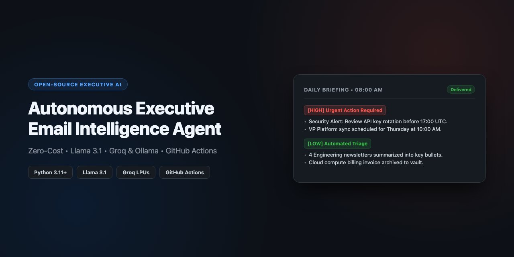

# Autonomous Executive Gmail Intelligence Agent




> A zero-cost, scheduled email summarization pipeline powered by **Llama 3.1** (Groq / local Ollama) and **GitHub Actions**. Delivers an actionable executive briefing to your inbox daily at 8:00 AM without requiring a local machine running 24/7.

---


---

## Enterprise & Private VPC Deployments

While this repository is fully functional for personal and developer workflows, running agentic pipelines across enterprise inboxes requires strict data governance, isolated compute, and corporate identity federation.

We design and deploy production-grade, zero-trust configurations tailored for leadership teams, family offices, and regulated industries:

* **Private Cloud Isolation**: Deployed entirely inside your corporate AWS, GCP, or Azure perimeter (VPC) with zero data leaving your boundary.
* **Model Privacy & Air-Gapping**: Self-hosted open-weight LLMs (Llama 3.1 via vLLM/Ollama) with strictly zero third-party API exposure or data retention.
* **Enterprise Mailbox Connectors**: Seamless integration with Google Workspace enterprise domains and Microsoft 365 / Exchange environments via enterprise OAuth/SAML.
* **Custom Semantic Schemas**: Specialized extraction models for deal-flow tracking (VC/PE), regulatory/contract deadlines (Legal), and C-suite escalations.
* **Day-2 Governance**: Automated OAuth token renewal, audit logging, failover monitoring, and strict role-based access control (RBAC).

**Interested in deploying an isolated intelligence agent for your executive team?**  
Reach out via [LinkedIn](https://www.linkedin.com) or open an inquiry in [GitHub Discussions](https://github.com/NehaAIML/autonomous-executive-agent/discussions).

---

## Architecture Overview

```
[Gmail API] ---> [Filter Unread Messages] ---> [Llama 3.1 (Groq API)]
                                                        |
[Automated Digest Email] <--- [MIME Compilation] <--- [Pydantic Validation]
                                                        ^
                                              (Scheduled via GitHub Actions)
```

- **Dual-Engine Execution**: Seamlessly switches between cloud inference (**Groq Cloud**) in CI/CD and local private inference (**Ollama**) when run on-premise.
- **Defensive Parsing**: Validates structured extraction via Pydantic schemas with automatic schema-echo fallback parsing.
- **Zero Cost**: Runs entirely within free-tier GitHub Actions minutes and free-tier Groq API limits.

---

## Quickstart Setup Guide

Deploy your own autonomous briefing assistant in three straightforward steps.

### Step 1: Generate Google Cloud OAuth Credentials

1. Open the Google Cloud Console (https://console.cloud.google.com/) and create a new project (`gmail-agent`).
2. Navigate to **APIs & Services > Library**, search for **Gmail API**, and click **Enable**.
3. Go to **OAuth consent screen**:
   - User Type: **External**.
   - App name: `Gmail Agent`.
   - Add your Gmail address under **Test Users**.
4. Go to **Credentials > Create Credentials > OAuth client ID**:
   - Application type: **Desktop app**.
   - Download the generated file and rename it to `credentials.json`.

---

### Step 2: Generate Authentication Token Locally

Clone the repository and authenticate once on your local machine to obtain your OAuth refresh token:

```bash
git clone https://github.com/NehaAIML/Email_agent.git
cd Email_agent/gmail-agent

python3 -m venv venv
source venv/bin/activate
pip install -r requirements.txt

# Place your downloaded credentials.json in this directory, then run:
python email_agent.py
```

A browser window will open asking you to grant read/send permissions. Upon sign-in, an authorized `token.json` file will automatically be created in your directory.

---

### Step 3: Configure GitHub Actions Secrets

To enable autonomous daily runs in the cloud, add your configuration under **Settings > Secrets and variables > Actions** in your GitHub repository:

- `GROQ_API_KEY`: Your API key from Groq Console (https://console.groq.com).
- `GMAIL_CREDENTIALS`: The full contents of your `credentials.json` file.
- `GMAIL_TOKEN`: The full contents of your generated `token.json` file.

The automated workflow (`.github/workflows/daily_digest.yml`) triggers every morning at 12:00 UTC (8:00 AM EDT) or manually via the **Run workflow** button in the **Actions** tab.

---

## Local Development

To run the agent locally using Ollama instead of Groq:

```bash
# Ensure Ollama is serving llama3.1
ollama run llama3.1:8b

# Run without GROQ_API_KEY environment variable set
python email_agent.py
```
